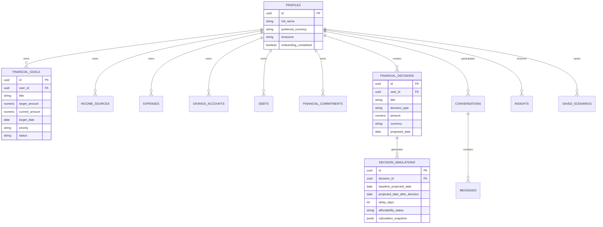

# 🌌 UseAimly (Useaimly) — SaaS Documentation & Architecture Guide

> **Tagline**: *"See tomorrow before deciding today"*  
> **Mission**: Plateforme d'intelligence décisionnelle financière orientée objectifs (*Goal-Aware Decision Intelligence Platform*).  
> **Positionnement**: Contrairement aux applications de budget classiques qui analysent le passé de manière culpabilisante, **UseAimly** est un instrument prédictif qui calcule l'impact de chaque décision financière présente sur la trajectoire des projets de vie futurs.

---

## 📑 Table des Matières
1. [Vue d'Ensemble & Proposition de Valeur](#1-vue-densemble--proposition-de-valeur)
2. [Philosophie Fondatrice : Le Modèle à 3 Piliers](#2-philosophie-fondatrice--le-modèle-à-3-piliers)
3. [Architecture Technique & Stack](#3-architecture-technique--stack)
4. [Arborescence Complète du Projet](#4-arborescence-complète-du-projet)
5. [Moteur Financier Déterministe (`src/lib/finance`)](#5-moteur-financier-déterministe-srclibfinance)
6. [Couche IA & NLP (`src/lib/ai` & `src/lib/nlp`)](#6-couche-ia--nlp-srclibai--srclibnlp)
7. [Schéma de Base de Données (Supabase & RLS)](#7-schéma-de-base-de-données-supabase--rls)
8. [Cartographie des Modules & Pages UI](#8-cartographie-des-modules--pages-ui)
9. [Design System & Composants Réutilisables](#9-design-system--composants-réutilisables)
10. [Guide de Démarrage & Commandes Utiles](#10-guide-de-démarrage--commandes-utiles)
11. [Guide pour les Développeurs & Règles d'Extension](#11-guide-pour-les-développeurs--règles-dextension)
12. [Refonte Globale Design System & Mobile Responsive](#12-refonte-globale-design-system--mobile-responsive)

---

## 1. Vue d'Ensemble & Proposition de Valeur

### Le Problème Résolu
Les outils de gestion de finances personnelles traditionnels (Mint, YNAB, tableurs Excel) souffrent de limitations majeures :
- **Rétrospectifs** : ils cataloguent ce qui a déjà été dépensé au lieu d'éclairer la prochaine décision.
- **Déconnectés des objectifs** : ils ne disent pas si acheter un smartphone à 30 000 KES retarde l'achat d'un terrain ou le lancement d'une entreprise de 10 jours ou de 6 mois.
- **Anxiogènes et rigides** : les budgets catégoriels stricts sont abandonnés dès le premier imprévu.

### La Solution UseAimly
1. **Destinations d'Abord** : L'utilisateur définit ses objectifs prioritaires (*Destinations*), ex: *"Lancer mon entreprise (500 000 KES pour Déc 2027)"*.
2. **Simulation Instantanée ("Decide")** : Avant un achat (ex: 30 000 KES), l'utilisateur tape sa question en langage naturel.
3. **Verdict Chiffré & Visuel** : L'outil calcule l'impact exact :
   - *Puis-je payer comptant ?* (Liquidités restantes)
   - *Mes charges fixes sont-elles protégées ?* (Mois de résilience)
   - *Combien de jours de retard sur mon objectif ?* (ex: +45 jours)
   - *Comment compenser ?* (Plan de récupération : +1 875 KES/mois pendant 16 mois)
4. **Foresight Proactif ("Insights")** : Détection automatique des baisses de rythme, des échéances annuelles lourdes (assurances, frais de scolarité) et des goulots d'étranglement.

---

## 2. Philosophie Fondatrice : Le Modèle à 3 Piliers

Toutes les simulations de UseAimly reposent sur l'évaluation simultanée de **3 piliers fondamentaux** :

```
                   ┌─────────────────────────────────────────┐
                   │       USEAIMLY DECISION ENGINE          │
                   └─────────────────────────────────────────┘
                                        │
        ┌───────────────────────────────┼───────────────────────────────┐
        ▼                               ▼                               ▼
┌───────────────────────┐   ┌───────────────────────┐   ┌───────────────────────┐
│       PILIER 1        │   │       PILIER 2        │   │       PILIER 3        │
│  CASH AFFORDABILITY   │   │ OBLIGATION RESILIENCE │   │  PLAN AFFORDABILITY   │
├───────────────────────┤   ├───────────────────────┤   ├───────────────────────┤
│ L'utilisateur a-t-il  │   │ Les charges fixes,    │   │ Quel est l'impact     │
│ les fonds liquides    │   │ dettes et le matelas  │   │ sur la date d'arrivée │
│ disponibles sans      │   │ d'urgence (3-6 mois)  │   │ de l'objectif         │
│ découvert immédiat ?  │   │ restent-ils saufs ?   │   │ prioritaire (retard)? │
└───────────────────────┘   └───────────────────────┘   └───────────────────────┘
```

### Règle d'Or de l'Architecture AI / Calcul
- **Les Calculs sont 100% Déterministes** : Aucune formule financière, aucune date, aucun montant n'est délégué à un LLM. Tout est calculé par du code TypeScript pur et testé par Vitest.
- **L'IA est Purement Explicative & Empathique** : Les modèles (OpenAI, Anthropic, Gemini ou Mock) reçoivent le résultat mathématique strict et génèrent une synthèse bienveillante structurée selon les **4 Piliers de Verdict UseAimly** :
  1. `whatYouCanDo` : Ce que l'utilisateur peut faire immédiatement.
  2. `whatItChanges` : Ce que la décision modifie sur les chiffres et les délais.
  3. `toStayOnTrack` : Les ajustements recommandés pour rester dans les temps.
  4. `UseaimlysRead` : La lecture stratégique et humaine de la situation.

---

## 3. Architecture Technique & Stack

| Couche | Technologie | Description |
| :--- | :--- | :--- |
| **Framework Web** | Next.js 15.1.7 (App Router) | React 19, Server & Client Components, Route Handlers |
| **Langage** | TypeScript 5.7.3 | Typage strict de tous les flux et états financiers |
| **Style & UI** | Tailwind CSS 3.4.17 + Radix UI | Dark/Light mode (`next-themes`), Radix Dialog, Tabs, Progress, Tooltip |
| **Visualisation** | Recharts 2.15.1 | Courbes de trajectoires financières, projections comparatives |
| **Base de Données** | Supabase (PostgreSQL 15+) | RLS activé sur 100% des tables, Triggers `updated_at`, Profils auto |
| **Validation** | Zod 3.24.2 + React Hook Form | Schémas stricts pour décisions, devises, finances et auth |
| **NLP** | Moteur Regex/Token personnalisé | Extraction sans latence des montants, devises et récurrences |
| **Providers IA** | Multi-Provider Abstraction | Support commutatif de `mock`, `openai`, `anthropic`, `gemini` |
| **Tests** | Vitest 3.0.5 | Tests unitaires, tests d'intégration et tests de stress aux limites |

---

## 4. Arborescence Complète du Projet

```text
UseAimly/
├── .env.example                     # Modèle des variables d'environnement
├── .env.local                       # Variables d'environnement locales
├── package.json                     # Dépendances et scripts de build/test
├── tsconfig.json                    # Configuration TypeScript
├── tailwind.config.ts               # Thème customisé (polices, couleurs, ombres)
├── vitest.config.ts                 # Configuration du lanceur de tests Vitest
├── supabase/
│   ├── schema.sql                   # Schéma PostgreSQL complet avec RLS & Seeds
│   └── migrations/                  # Fichiers de migration de version
├── src/
│   ├── middleware.ts                # Middleware d'authentification Supabase SSR
│   ├── app/                         # Routes de l'application Next.js (App Router)
│   │   ├── layout.tsx               # Root Layout avec providers (Theme, Auth, Query)
│   │   ├── page.tsx                 # Landing Page immersive & simulateur interactif
│   │   ├── globals.css              # Styles globaux Tailwind et variables CSS
│   │   ├── login/                   # Page de connexion
│   │   ├── signup/                  # Page d'inscription
│   │   ├── forgot-password/         # Récupération de mot de passe
│   │   ├── reset-password/          # Réinitialisation de mot de passe
│   │   ├── onboarding/              # Tunnel d'onboarding en 7 étapes
│   │   │   ├── page.tsx
│   │   │   └── components/          # Composants Steps 1 à 7 + StepIndicator
│   │   ├── design-system/           # Galerie de prévisualisation des composants
│   │   ├── api/                     # Route Handlers backend Next.js
│   │   │   ├── chat/route.ts        # Endpoint API pour le chat financier
│   │   │   ├── explain/route.ts     # Endpoint d'explication de décision par l'IA
│   │   │   └── simulate/route.ts    # Endpoint de calcul de simulation
│   │   └── app/                     # Espace Authentifié Dashboard
│   │       ├── layout.tsx           # Layout avec Sidebar, Header & navigation
│   │       ├── page.tsx             # Dashboard principal (Hero Trajectory, Path, Before You Decide)
│   │       ├── decide/page.tsx      # Studio de décision & comparaison de 3 stratégies
│   │       ├── goals/               # Hub des objectifs financiers
│   │       │   ├── page.tsx         # Liste & statut des objectifs
│   │       │   └── [id]/page.tsx    # Vue détaillée d'un objectif (Radar, historique, pace)
│   │       ├── money/page.tsx       # Gestion des 6 flux (Revenus, Dépenses, Épargne, Dettes, Engagements)
│   │       ├── what-if/page.tsx     # Sandbox de simulation "Et si ?"
│   │       ├── ask/page.tsx         # Assistant conversationnel financier
│   │       ├── insights/page.tsx    # Flux des alertes et prévisions proactives
│   │       └── settings/page.tsx    # Préférences utilisateur, devises et données
│   ├── components/                  # Composants UI React
│   │   ├── ui/                      # Éléments atomiques (Button, Card, Badge, Input, Tabs, Progress)
│   │   ├── layout/                  # Header, Footer, Container, ThemeToggle
│   │   ├── providers/               # ClientProviders, ThemeProvider
│   │   ├── finance/                 # Composants métier (TrajectoryChart, DecisionSimulatorCard, etc.)
│   │   ├── dashboard/               # Sections du dashboard (TrajectoryHeroChart, YourPathSection, etc.)
│   │   └── design-system/           # Système visuel (MoneyInput, FinancialStatus, DecisionImpactCard, etc.)
│   ├── lib/                         # Logique métier, types et utilitaires
│   │   ├── types/                   # Interfaces TypeScript (finance, decision, goal, ai, user)
│   │   ├── finance/                 # Moteur de calcul financier déterministe
│   │   │   ├── normalization/       # Normalisation des fréquences vers le mensuel
│   │   │   ├── income/              # Calculateur de revenus nets et bruts
│   │   │   ├── expenses/            # Calculateur de dépenses fixes/variables
│   │   │   ├── debt/                # Calculateur d'échéances et intérêts de dette
│   │   │   ├── cash-flow/           # Calculateur de Free Cash Flow mensuel
│   │   │   ├── goals/               # Évaluateur d'avancement et faisabilité d'objectif
│   │   │   ├── trajectories/        # Calculateur de courbes d'accumulation temporelle
│   │   │   ├── simulations/         # Moteur de simulation à 3 Piliers
│   │   │   ├── health/              # Métriques de santé financière (Runway, Buffer)
│   │   │   ├── demo-data.ts         # Données financières de démonstration
│   │   │   └── index.ts             # Point d'entrée unique du module financier
│   │   ├── ai/                      # Couche d'orchestration IA
│   │   │   ├── conversational-engine.ts # Moteur conversationnel
│   │   │   ├── explanation-engine.ts    # Générateur d'explications
│   │   │   └── providers/               # Implémentations Mock, Gemini, OpenAI
│   │   ├── nlp/                     # Parser de langage naturel pour requêtes d'achat
│   │   ├── insights/                # Moteur de règles d'insights proactifs
│   │   ├── onboarding/              # Calculateur et présets d'onboarding
│   │   ├── destinations/            # Données et structures des destinations
│   │   ├── auth/                    # Context Auth, Actions Supabase Server
│   │   ├── supabase/                # Clients Supabase Browser, Server et types DB
│   │   ├── validation/              # Schémas Zod (auth, decision, finance, goal)
│   │   └── utils/                   # Formatage monétaire, dates et maths
│   └── tests/                       # Suite de tests automatisés Vitest
│       ├── finance/                 # Tests déterministes, flux de trésorerie, edge cases
│       ├── ai/                      # Tests conversationnels
│       ├── nlp/                     # Tests du parser de requêtes
│       ├── insights/                # Tests des règles d'insights
│       ├── onboarding/              # Tests de l'onboarding
│       ├── auth/                    # Tests de validation d'authentification
│       └── supabase/                # Tests de schéma et RLS
```

---

## 5. Moteur Financier Déterministe (`src/lib/finance`)

Le moteur financier est le cœur d'UseAimly. Il est 100% pur, sans effets de bord et complètement découplé de l'interface utilisateur.

### Formules & Normalisation Fréquentielle
Toutes les entrées (hebdomadaires, bimensuelles, trimestrielles, annuelles, ponctuelles) sont normalisées en équivalent mensuel :
- **Hebdomadaire** : `(Montant * 52) / 12`
- **Bimensuel (toutes les 2 semaines)** : `(Montant * 26) / 12`
- **Trimestriel** : `Montant / 3`
- **Annuel** : `Montant / 12`

### Calculs Clés
1. **Revenu Brut Mensuel** = $\sum \text{Revenus normalisés actifs}$
2. **Total Dépenses Fixes & Variables** = $\sum \text{Dépenses mensuelles} + \sum \text{Engagements annualisés}$
3. **Service de la Dette** = $\sum \text{Paiements mensuels de crédit}$
4. **Cash Flow Libre Mensuel (Free Cash Flow)** :
   $$\text{Free Cash Flow} = \text{Revenu Brut} - (\text{Dépenses} + \text{Service Dette})$$
5. **Délai d'Impact de Décision (en jours)** :
   $$\text{Délai (jours)} = \left\lceil \frac{\text{Montant Décision}}{\text{Allocation Mensuelle Objectif}} \right\rceil \times 30$$
6. **Effort de Récupération Mensuelle** :
   $$\text{Montant Mensuel Complémentaire} = \frac{\text{Montant Décision}}{\text{Mois Restants avant Échéance}}$$

---

## 6. Couche IA & NLP (`src/lib/ai` & `src/lib/nlp`)

### 1. Le Parser NLP Déterministe (`src/lib/nlp/decision-query-parser.ts`)
Extrait instantanément à partir de phrases comme *"Puis-je dépenser 30k KES pour un smartphone ?"* :
- Montant : `30000` (supporte les suffixes `k`, virgules, notations $ ou KES).
- Devise : `KES` (reconnaissance de USD, EUR, GBP, KES, KSH, etc.).
- Récurrence : `isRecurring: false` (détecte les mots clés comme "par mois", "abonnement", "loyer").
- Type de Décision : `ONE_OFF_PURCHASE` ou `RECURRING_EXPENSE`.
- Titre Nettoyé : `"Smartphone Purchase"`.

### 2. Le Moteur d'Insights Proactifs (`src/lib/insights/insight-engine.ts`)
Évalue en temps réel 6 règles fondamentales :
1. **Pace Shortfall** : Avertissement si la contribution mensuelle actuelle est inférieure au montant requis pour l'échéance.
2. **Ahead Velocity** : Notification positive si l'épargne actuelle fait gagner des mois d'avance sur l'objectif.
3. **Commitment Spike** : Alerte 60 jours avant une grosse dépense annuelle (assurance, impôt).
4. **Debt Drag** : Détection du coût d'opportunité des intérêts d'emprunt.
5. **Cash Cushion Deficit** : Alerte si la réserve liquide passe sous les 3 mois de charges fixes.
6. **Cumulative Decision Drag** : Mesure du retard cumulé causé par les décisions des 30 derniers jours.

### 3. Orchestration Multi-Provider (`src/lib/ai/providers/`)
- `mock-provider.ts` : Fournit des réponses réalistes ultra-rapides en local sans consommer de tokens.
- `gemini-provider.ts` : Intégration Google Gemini Flash (`gemini-1.5-flash`).
- `openai-provider.ts` : Intégration OpenAI (`gpt-4o-mini`).
- Configuration via la variable d'environnement `AI_PROVIDER=mock|gemini|openai|anthropic`.

---

## 7. Schéma de Base de Données (Supabase & RLS)

Le fichier `supabase/schema.sql` contient la structure complète. Toutes les tables sont protégées par **Row Level Security (RLS)** pour garantir l'isolation stricte des données utilisateurs.



---

## 8. Cartographie des Modules & Pages UI

### 1. Landing Page (`src/app/page.tsx`)
- **Hero Canvas** : Simulateur interactif en direct avec pastilles flottantes et ajustement de montant en temps réel.
- **Section Démonstration Trajectoire** : Graphique d'accumulation montrant le gap de décision.
- **Grille de Valeur & Témoignages** : Présentation du contraste entre budget traditionnel et décision prédictive.

### 2. Tunnel d'Onboarding (`src/app/onboarding/`)
- **Step 1** : Choix de la Destination principale (ex: Entreprise, Immobilier, Fonds d'urgence).
- **Step 2** : Sources de revenus (salaire, consulting, dividendes) et niveau de régularité.
- **Step 3** : Dépenses essentielles de la vie courante.
- **Step 4** : Passifs et remboursements de dettes.
- **Step 5** : Comptes d'épargne et liquidités immédiatement mobilisables.
- **Step 6** : Engagements périodiques (frais annuels, impôts).
- **Step 7** : Trajectory Reveal (Révélation de la date d'arrivée calculée et redirection vers le dashboard).

### 3. Dashboard Principal (`src/app/app/page.tsx`)
- **TrajectoryHeroChart** : Visualisation monumentale de la courbe vers l'objectif principal avec marqueurs d'arrivée.
- **YourPathSection** : Décomposition du flux mensuel (Entrées, Sorties obligatoires, Restant pour les objectifs, Épargne totale).
- **BeforeYouDecide** : Widget de simulation rapide directement accessible.
- **LookAheadSection** : Cartes d'anticipation pour les 30 à 90 prochains jours.
- **RecentDecisionsSection** : Historique des décisions passées et de leur impact effectif.
- **PrimeInsightSection** : L'insight prioritaire numéro un à traiter aujourd'hui.

### 4. Studio "Decide" (`src/app/app/decide/page.tsx`)
- Barre de saisie en langage naturel assistée par NLP.
- Comparaison interactive entre **3 stratégies concrètes** :
  1. *Payer comptant (Cash Buffer)* : Impact sur la trésorerie liquide immédiate.
  2. *Échelonner (Spread)* : Impact de l'étalement sur 3 mois sur le cashflow mensuel.
  3. *Reporter (Postpone)* : Épargner progressivement avant d'acheter sans dévier de l'objectif.
- Visualisation de la trajectoire Avant / Après.

### 5. Hub "Goals" (`src/app/app/goals/`)
- Gestion multi-objectifs classés par niveau de criticité.
- Page détaillée d'un objectif (`[id]/page.tsx`) incluant le radar des risques, l'historique des contributions et le réglage de l'allocation mensuelle.

### 6. Hub "Money" (`src/app/app/money/page.tsx`)
- Registre financier structuré en 6 sous-onglets : Vue d'ensemble, Revenus, Dépenses, Épargne, Dettes, Engagements.
- Ajout, modification et suppression dynamique d'éléments avec recalcul instantané du Free Cash Flow.

### 7. Sandbox "What-If" (`src/app/app/what-if/page.tsx`)
- Laboratoire de simulation d'hypothèses de vie :
  - *Et si je gagnais 25k de plus ?*
  - *Et si je réduisais mes abonnements de 12k ?*
  - *Et si je contractais un emprunt ?*
- Comparaison dynamique des courbes d'accumulation et des dates d'arrivée.

### 8. Assistant "Ask" (`src/app/app/ask/page.tsx`)
- Interface de discussion connectée au moteur de calcul déterministe.
- Génération de cartes de synthèse riches (`DECISION_SIMULATION`, `DESTINATION_STATUS`).

---

## 9. Design System & Composants Réutilisables

Les composants graphiques se trouvent dans `src/components/design-system/` et `src/components/ui/` :

| Composant | Rôle & Usage |
| :--- | :--- |
| **`MoneyInput`** | Champ de saisie monétaire avec formatage automatique, sélection de devise et support des abréviations (`k`). |
| **`FinancialStatus`** | Badge de statut d'impact (`SAFE`, `MANAGEABLE`, `HIGH_IMPACT`, `OFF_TRACK`) avec styles harmonisés. |
| **`DecisionImpactCard`** | Carte visuelle résumant les deltas d'une décision (jours de retard, cash restant, mensualité de rattrapage). |
| **`TrajectoryHeroChart`** | Graphique Recharts grand format avec courbes d'accumulation baseline vs projetée. |
| **`DestinationCard`** | Carte synthétique d'avancement d'un projet de vie avec barre de progression et date d'arrivée. |
| **`InsightCard`** | Carte d'alerte proactive avec sévérité (`INFO`, `NOTICE`, `WARNING`, `CRITICAL`) et bouton d'action directe. |
| **`ConfirmDialog`** | Dialogue modal Radix accessible pour les confirmations destructives ou engageantes. |

---

## 10. Guide de Démarrage & Commandes Utiles

### Prérequis
- Node.js 18+ (recommandé v20+)
- npm ou pnpm
- Compte Supabase (ou instance locale Supabase CLI)

### 1. Installation
```bash
# Cloner le dépôt et se placer dans le dossier
cd UseAimly

# Installer les dépendances
npm install
```

### 2. Configuration des Variables d'Environnement
Copier le fichier exemple et renseigner les clés Supabase et IA :
```bash
cp .env.example .env.local
```
Contenu minimal de `.env.local` :
```env
NEXT_PUBLIC_APP_URL=http://localhost:3000
NEXT_PUBLIC_APP_NAME=UseAimly
NEXT_PUBLIC_DEFAULT_CURRENCY=KES

NEXT_PUBLIC_SUPABASE_URL=https://votre-projet.supabase.co
NEXT_PUBLIC_SUPABASE_ANON_KEY=votre-cle-anon
SUPABASE_SERVICE_ROLE_KEY=votre-cle-service-role

# Fournisseur IA : 'mock' pour tester en local sans frais, 'gemini' ou 'openai' en prod
AI_PROVIDER=mock
GEMINI_API_KEY=
OPENAI_API_KEY=
```

### 3. Initialisation de la Base de Données
Dans votre interface Supabase (SQL Editor), exécutez le contenu complet de :
`supabase/schema.sql`

### 4. Lancement du Serveur de Développement
```bash
npm run dev
# L'application est disponible sur http://localhost:3000
```

### 5. Exécution des Tests Automatisés
```bash
# Lancer l'ensemble de la suite de tests Vitest
npm test

# Lancer les tests en mode surveillance continue (watch)
npm run test:watch
```

---

## 11. Guide pour les Développeurs & Règles d'Extension

### Règle 1 : Ne JAMAIS déléguer de calcul financier à l'IA
Si vous ajoutez une nouvelle fonctionnalité (ex: simulation de rachat de crédit, investissement en bourse, inflation) :
1. Créez la fonction mathématique pure dans `src/lib/finance/`.
2. Écrivez les tests unitaires associés dans `src/tests/finance/`.
3. Passez le résultat structuré dans le payload destiné à la couche `src/lib/ai/explanation-engine.ts`.

### Règle 2 : Respecter la convention de typage Zod
Chaque nouveau formulaire ou endpoint API doit valider ses entrées avec un schéma Zod dédié dans `src/lib/validation/`.

### Règle 3 : Maintenir la compatibilité multi-devises
Utilisez systématiquement l'utilitaire `formatCurrency(amount, currency)` issu de `src/lib/utils/currency.ts` au lieu de coder en dur des symboles monétaires.

### Règle 4 : Sécurité & RLS
Toute nouvelle table ajoutée à PostgreSQL doit impérativement inclure :
- `ALTER TABLE public.nom_table ENABLE ROW LEVEL SECURITY;`
- Les politiques `SELECT`, `INSERT`, `UPDATE`, `DELETE` restreintes à `auth.uid() = user_id`.

---

## 12. Refonte Globale Design System & Mobile Responsive

### 🎨 1. Identité Visuelle & Tokens de Design
- **Fonds & Surfaces** : Arrière-plan somptueux en charcoal chaud (`#131211`), cartes surélevées (`#1C1A18`), et surfaces secondaires tonales (`#262421`).
- **Pigment Signature** : Orange UseAimly (`#FF5533` / `hsl(14, 100%, 58%)`) réservé aux actions primaires, entrées de décision et deltas de trajectoire.
- **Sémantique Trajectoire** : Vert émeraude des sous-bois (`on-track`), ambre chaud (`at-risk`), rouge corail (`off-track`), et bleu cyan (`ahead`).

### 📱 2. Architecture Mobile Responsive Ultra-Premium
- **Anti-Overflow Global** : Règle stricte `overflow-x-hidden max-w-full` appliquée sur `html` et `body` dans `src/app/globals.css`.
- **Formulaires & Boutons Tactiles** : Les barres de recherche et formulaires de simulation basculent en disposition verticale empilée (`flex-col sm:flex-row`) avec une hauteur minimale de zone de frappe (`min-h-[44px]`).
- **Correction iOS** : Neutralisation du zoom automatique Safari iOS via une taille de police minimale de `16px` sur les entrées de formulaire mobiles.
- **Grille Métriques 2x2** : Affichage des indicateurs financiers et rythmes mensuels en grille 2x2 fluide sur smartphones (`grid-cols-2 lg:grid-cols-4`).
- **Onglets Tactiles Sans Scrollbars** : Utilisation de la classe utilitaire `.no-scrollbar` pour un défilement horizontal fluide au doigt sur les sous-navigations (`Goals`, `Money Hub`).

### 🔑 3. Logique d'Affichage Dynamique Auth CTAs
- **Utilisateur Connecté** : Les boutons d'incitation à l'inscription (ex: *"Create Free Account"*, *"Get Started Free"*) sont automatiquement masqués au profit d'actions directes de navigation (*"Go to Dashboard"*, *"Simulate Decision"*, *"Open Decision Studio"*).
- **Invités / Non Connectés** : Affichage des boutons d'acquisition (*"Try Live Demo"*, *"Create Free Account"*).

### 📄 5. Générateur de Rapport PDF Exécutif de Trajectoire (`jspdf`)
- **Export PDF Officiel** : Permet de télécharger à tout moment un dossier financier exécutif haute-fidélité (`UseAimly_Report_...pdf`).
- **Contenu du Rapport** : En-tête officiel UseAimly, verdict de trajectoire, décomposition complète des capacités financières (Revenus, Dépenses, Dettes, Épargne liquide), métriques d'accélération et le plan d'action stratégique IA en 4 piliers.
- **Intégration** : Accessible directement à l'Étape 7 du Live Demo (`/onboarding`) et dans le Studio de Décision (`/app/decide`).

### 🚀 7. Alignment 1:1 de la Landing Page sur les Maquettes Visuelles
- **Hero & Widget Flottant** : Disposition 2 colonnes avec titre principal **"See tomorrow before deciding today."**, boutons d'action (*Try a Real Decision* → `/onboarding`), rangée d'avatars de preuve sociale (`5.0 ★★★★★ Trusted by 1,000+ smart decision makers`), et widget interactif flottant avec analyse en direct (*Immediate Impact*, *Future Consequence*, *Stay on Track*).
- **Section "Why UseAimly?"** : 4 piliers visuels d'orientation (*Look Forward*, *Understand Impact*, *Make Better Choices*, *Stay on Track*).
- **Section "How UseAimly Works"** : 4 étapes numérotées explicatives (*01 Add Your Picture*, *02 Set Your Destinations*, *03 Ask About a Decision*, *04 See the Impact*).
- **Partenaires & Témoignages** : Bandeau de logos d'institutions financières (`Safaricom`, `M-PESA`, `EQUITY`, `KCB`, `NCBA`, `ABSA`) et carte de témoignage interactive (Citation de Grace W., Business Owner).
- **Grille des 4 Scénarios d'Achat Réels** : Cartes d'impacts pour les achats fréquents (*Acheter un téléphone pour 30k KES*, *Prendre un crédit de 150k KES*, *Déménager dans un meilleur appartement*, *Prendre des vacances pour 80k KES*).
- **Grille de Tarification Transparente** : Offres Free (0 KES), Pro (1 499 KES), et Premium (2 499 KES).
- **Bandeau de Conversion Final** : Apporteur d'action *"Stop guessing. See what your decisions really do."*.

### 🎨 8. Rendu Vectoriel du Logo Officiel UseAimly sur l'En-tête PDF
- **En-tête Officiel 300+ DPI** : Rendu vectoriel natif de l'icône anneau/cible avec sa flèche de trajectoire Orange (`#FF5533`), du nom de marque **Use** (Blanc) **Aimly** (Orange), du slogan *"See tomorrow before deciding today"*, de la date du jour et du numéro de référence unique (`REF: UAM-...`).

### ⚙️ 9. Gestion de la Fréquence & Conseils WhatsApp Autonomes
- **Sélecteur de Fréquence** : Choix par l'utilisateur entre *Tous les dimanches à 19h00*, *Tous les 3 jours (Mode Intensif)*, *Bi-mensuel (Tous les 15 jours)*, et *Décalage de trajectoire uniquement*.
- **Déclencheurs de Contenu** : Toggles personnalisables pour le rythme d'objectif (*Goal Target Pace*), les avertissements d'échéances 30 jours (*Obligation Warnings*), et les conseils du coach IA (*AI Strategic Tips*).

---

*Documentation mise à jour pour UseAimly — Conservée comme référence d'ingénierie, de design system et de conception produit.*

